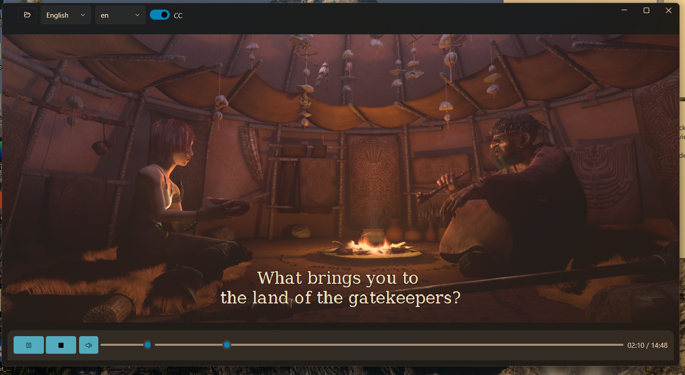
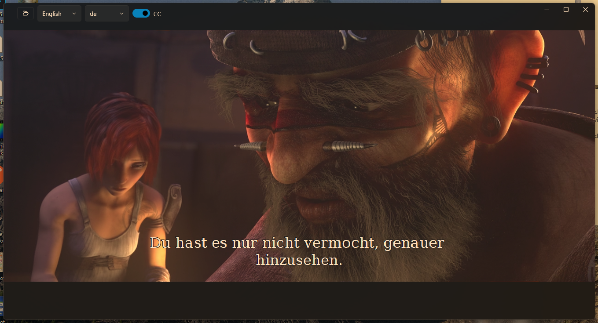

# TinyPlayer

A lightweight video player built with WPF, GStreamer, and the [WPF-UI](https://github.com/lepoco/wpfui) framework featuring a modern Fluent Design interface.





## Features

- Video playback via GStreamer pipeline
- Multiple audio track switching
- Subtitle support with track selection
- Volume control with mute toggle
- Seek with progress bar
- Fullscreen mode (hides taskbar)
- Fluent Design with Mica backdrop (Windows 11)
- Auto-hide controls during playback

## Supported Formats

All formats supported by GStreamer - including `mp4`, `mkv`, `avi`, `mov`, `wmv`, `flv`, `webm` and more.

## Requirements

- Windows 10/11
- [.NET 10](https://dotnet.microsoft.com/download)
- [GStreamer 1.x](https://gstreamer.freedesktop.org/download/) (with `d3dvideosink` plugin)

### GStreamer Installation

1. Download and install **GStreamer runtime** [from the official site](https://gstreamer.freedesktop.org/documentation/installing/on-windows.html?gi-language=c)
2. Make sure to select **Complete** installation - not Typical
3. Add GStreamer to your `PATH`:
   ```
   C:\gstreamer\1.0\msvc_x86_64\bin
   ```

## Getting Started

```bash
git clone https://github.com/Ledrunning/TinyPlayer
cd TinyPlayer
dotnet restore
dotnet build
dotnet run --project TinyPlayer.Desktop
```

## Project Structure

```
TinyPlayer/
├── TinyPlayer.Core/          # GStreamer core library (framework-agnostic)
│   ├── VideoPlayerCore.cs    # Pipeline management
│   ├── VideoSinkFactory.cs   # Video sink setup & HWND overlay
│   ├── Enums/
│   │   └── AvFlagsType.cs
│   └── Models/
│       ├── MetadataModel.cs
│       └── StreamItem.cs
│
└── TinyPlayer.Desktop/       # WPF UI application
    ├── View/
    │   └── MainWindow.xaml
    ├── ViewModel/
    │   └── MainViewModel.cs
    └── Controls/
        └── VideoHost.cs      # HwndHost for GStreamer overlay
```

## Architecture

TinyPlayer follows **MVVM** pattern using [CommunityToolkit.Mvvm](https://learn.microsoft.com/en-us/dotnet/communitytoolkit/mvvm/).

The core library (`TinyPlayer.Core`) has no UI dependencies - it communicates with the ViewModel through events:

| Event             | Description                             |
| ----------------- | --------------------------------------- |
| `PositionChanged` | Current playback position & duration    |
| `StreamsAnalysed` | Audio/subtitle track metadata           |
| `StateChanged`    | Pipeline state (Playing, Paused, Ready) |
| `ErrorOccurred`   | Playback errors                         |
| `EndOfStream`     | Playback finished                       |

## Keyboard Shortcuts

| Key            | Action            |
| -------------- | ----------------- |
| `Double Click` | Toggle fullscreen |
| `Escape`       | Exit fullscreen   |

## Dependencies

| Package                                                                              | Purpose                    |
| ------------------------------------------------------------------------------------ | -------------------------- |
| [WPF-UI](https://github.com/lepoco/wpfui)                                            | Fluent Design UI framework |
| [CommunityToolkit.Mvvm](https://github.com/CommunityToolkit/dotnet)                  | MVVM source generators     |
| [GtkSharp / GstreamerSharp](https://www.nuget.org/packages/gstreamer-sharp-netcore/) | GStreamer .NET bindings    |

## Test Videos

Good sources for testing multiple audio tracks and subtitles:

- [Sintel](https://download.blender.org/demo/movies/Sintel.2010.720p.mkv) - Blender Open Movie, multiple subtitle languages
- [Tears of Steel](https://download.blender.org/demo/movies/ToS/tears_of_steel_1080p.mov) - Blender Open Movie

## License

MIT
